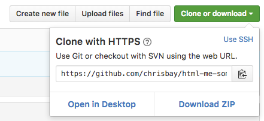

# HTML Me Something

You've learned a bit of HTML and some CSS, but you likely only used it in bits and pieces, adding or modifying content in exercises or pre-existing files. We're going to take another step forward here. You'll be building your own web page from scratch, and utilizing GitHub for storing and hosting your page. At the end of this exercise, you'll add your work to a repository of your classmate's work.

## Getting started

There are two parts to this exercise, one focused on HTML and another focused on CSS. HTML makes up the *structure and content* of web pages, while CSS dictates the *visual style*.

Best practices dictate that these should be kept as separate as possible. To that end, we'll build the HTML portion of our page first, followed by adding a few styles with CSS. This will help us avoid adding HTML elements simply to change the style of our page.

### Fork and clone

To get started, you'll need to make a copy of this repository on your own computer. Rather than just download it, we'll use Git to manage the copying process, so that your work will be managed with version control, and can easily be incorporated back into this project when you're done.

You should have already:
* installed Git on your computer
* created a GitHub account
* configured your Git install to use your GitHub account
* practiced basic Git commands such as `add`, `commit`, and `push`

If you haven't done these things, go back and do the pre-work outlined on the course page.

Now, fork this project by clicking on the Fork button at the top right of this page:


Recall that this makes a *copy* of the repository and places it in your GitHub account. GitHub will redirect to your new project page once the fork has been created. At the top right, click on the "Clone or Download" button and copy the URL from the text box.



Now, in a terminal navigate to the directory where you store your code, and type

```
$ git clone [URL]
```

where `[URL]` is the URL you copied from GitHub, pasted into the terminal. This will clone your copy of the `html-me-something` repository to your computer.

Verify that everything went according to plan by changing directories into the new project, and checking the Git status.

```
$ cd html-me-something/
$ git status
```

You should see a message like this:

```
On branch master
Your branch is up-to-date with 'origin/master'.
nothing to commit, working directory clean
```

If you don't, make sure you're in the correct directory (use `pwd`), retrace your steps through the instructions above.

## Getting to work

- HTML portion

- CSS portion

## Submitting your work
