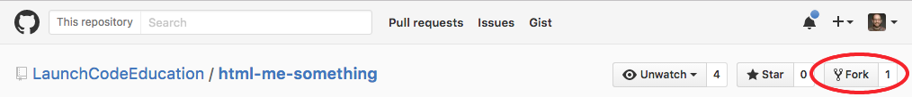
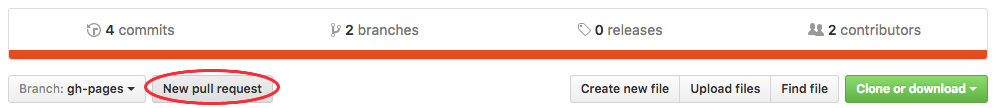
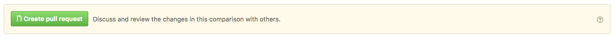

# HTML Me Something

You've learned a bit of HTML and some CSS, but you have likely only used it in bits and pieces so far, adding or modifying content in exercises or pre-existing files. We're going to take another step forward here.

You'll be building your own web page from scratch, and utilizing GitHub for storing and hosting your page. GitHub's primary use is to host Git repositories, but they also have a cool feature called [GitHub Pages](https://pages.github.com/) that allows you to easily host web sites that consist of only HTML and CSS (and perhaps some front-end JavaScript). You will build your own site using GitHub Pages, and once you're finished you will  add your work back to this repository, where it will be listed alongside that of your classmates.

## Getting started

There are two parts to this exercise, one focused on HTML and another focused on CSS. HTML makes up the *structure and content* of web pages, while CSS dictates the *visual style*.

Best practices dictate that these should be kept as separate as possible. To that end, we'll build the HTML portion of our page first, and only then add a few styles with CSS. This will help us avoid adding HTML elements simply to change the style of our page.

### Fork and clone

To get started, you'll need to make a copy of this repository on your own computer. Rather than just download it, we'll use Git to manage the copying process so that your work will be managed with version control, and can easily be incorporated back into this project when you're done.

You should have already:
* installed Git on your computer
* created a GitHub account
* configured your Git install to use your GitHub account
* practiced basic Git commands such as `add`, `commit`, and `push`

If you haven't done these things, go back and do the pre-work outlined on the course page.

Now, fork this project by clicking on the Fork button at the top right of this page:



Recall that this makes a *copy* of the repository and places it in your GitHub account. GitHub will redirect you to your new project page once the fork has been created. At the top right of this page, click on the "Clone or download" button and copy the URL from the text box.


Now, in a terminal navigate to the directory where you store your code, and type

```
$ git clone [URL]
```

where `[URL]` is the URL you copied from GitHub, pasted into the terminal. This will clone your copy of the `html-me-something` repository to your computer, so that you have a copy of the repository to work on locally.

Verify that everything went according to plan by changing directories into the new project, and checking the Git status.

```
$ cd html-me-something/
$ git status
```

You should see a message like this:

```
On branch master
Your branch is up-to-date with 'origin/master'.
nothing to commit, working directory clean
```

If you don't, make sure you're in the correct directory (use `pwd`), and then retrace your steps through the instructions above.

A few more steps and we'll be ready to go:

* In the `submissions` directory, create a new directory with the same name as your GitHub username:
```
$ cd submissions/
$ mkdir [USERNAME]
```
* Create and save a new file, `index.html`, within your username directory. Add a single line with the following HTML and save: `<p>YOUR NAME</p>`
* In Terminal, from the project root folder (you'll need to run `cd ..` to get there) run `git status` and then, if all looks good, run `git add .` to stage your new file. Then commit and push it to your GitHub repo.

    ```
    $ git commit -m "Adding my submission"
    [gh-pages 4875550] Adding my submission
     1 file changed, 1 insertions(+)
     create mode 100644 submissions/chrisbay/index.html
    $ git push origin gh-pages
    ```
    When pushing, note that we push to the `gh-pages` branch of the project, not the `master` branch (as you'll often be, and will often see in documentation).
* You should be able to view your page live at **http://[USERNAME].github.io/html-me-something/submissions/[USERNAME]/** (replace [USERNAME] with your GitHub username). This may take a few minutes to go live, so if you don't see it right away, try again in a few minutes. That simply putting your code in a repository on GitHub with a couple of special settings (which we took care of for you) results in a live website is the magic of [GitHub Pages](https://pages.github.com). Normally, a lot more work is needed to put a page on the internet.

## Getting to work

Now it's time to build out your page! Dive in, then come back here to follow submission instructions.

[Part 1: HTML](https://github.com/LaunchCodeEducation/html-me-something/tree/gh-pages/html)

[Part 2: CSS](https://github.com/LaunchCodeEducation/html-me-something/tree/gh-pages/css)

## Submitting your work

### Pull request

Now that you've created a lovely page, let's request that it be added to the main project repository, so course staff can add it to the class submissions directory.

Visit your project page on GitHub. Since this project is a fork of the class repository, you will see the option to create a new pull request near the top. Hit the button!



On the next page, you'll see a bunch of info about the changes between your project and the main project. Scan these to get a feel for what GitHub is doing, and to make sure everything looks correct. When you're ready, go ahead and create the pull request by hitting the "Create pull request" button.



What's going on here? To put it briefly, you're asking the owners of the main project repository which you forked/copied (i.e. LaunchCode staff) to incorporate a set of your changes into their repository. The owners will review your changes, and if everything looks good, they will merge them into the main repository. If you make additional changes to your project after submitting the pull request, those will *not* be incorporated into the main project. You would need to create an additional pull request to do that.

This pattern of development -- fork, clone, modify, commit, push, pull request -- is one of the main ways that coders collaborate on GitHub, particularly on open source projects.

### Vocareum

You also need to submit your work on Vocareum for grading. Log in and follow the instructions for this particular assignment.
